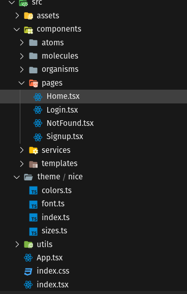

# Wall-App FrontEnd

To run this project make sure you have nvm or NodeJS and run following commands:

    npm install
    npm start

This is a FrontEnd App created with <strong>ReactJS</strong> and <strong>TypeScript</strong>.

## Design pattern

Used [Atomic Design Pattern](https://atomicdesign.bradfrost.com/chapter-2/) as it follows:

## Dependencies

Used some dependencies like:

- [styled components](https://styled-components.com/)
- [axios](https://github.com/axios/axios)
- [react-icons](https://react-icons.github.io/react-icons/)
- [react bootstrap](https://react-bootstrap.github.io/)

## Tests

No test yet!

## API
Consuming from [API](https://wall-app-api-br.herokuapp.com/)

Repository [here](https://github.com/ficast/wallapp-backend)

## Deployment

Hosted for free at [Heroku](https://www.heroku.com/) on https://wall-app-br.herokuapp.com/
